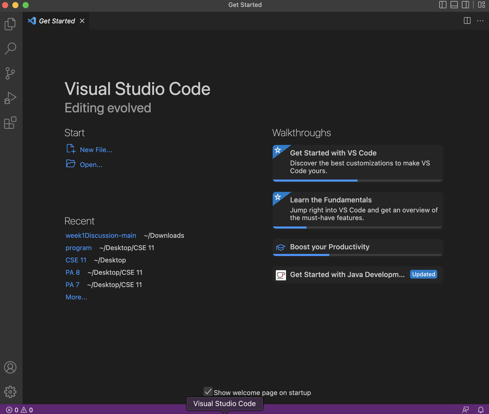

# Marisa Kawakami Week 1: Lab Report 

## Installing VScode 
1. Open the link in order to get to the Visual Studio Code website to start downloading and installing it onto your computer. 
[VScode](https://code.visualstudio.com/)
2. Depending on the device that you are downloading this on, be sure to follow the different directions. 
4. Once this has been installed you should be able to view the page seen below. 

## Remotely Connecting 
1. Once you have both VScode installed, open a terminal in VScode. In the terminal using your own personal identification letters for the class you will be able to access your personal information from that account on a different system. 
2. In the terminal you want to type out `ssh cs15lwi23amb@ieng6.ucsd.edu`
   - The first nine combination of letters and numbers are the course specific accounts. The last three are specific to your own personal accounts. (in my case it is amb)
4. Once putting in this command, espically if it is the first time you are connecting to the server it will ask you if you are sure you want to continue connecting to the server. Since you want to continue type `yes`.
5. It will then prompt you to fill in your password, when typing it will not show up as anything. However, once you have successfully logged in you should see something like this. 

Now you have sucessfully remotely connected! 
## Trying Some Commands 
1. Now that you are in the terminal you can try running different commands.
   - `cd` 
   - `ls`
   - `pwd`
   - `cd ..`
   - `cat /home/linux/ieng6/cs15lwi23/public/hello.txt`
   - 

