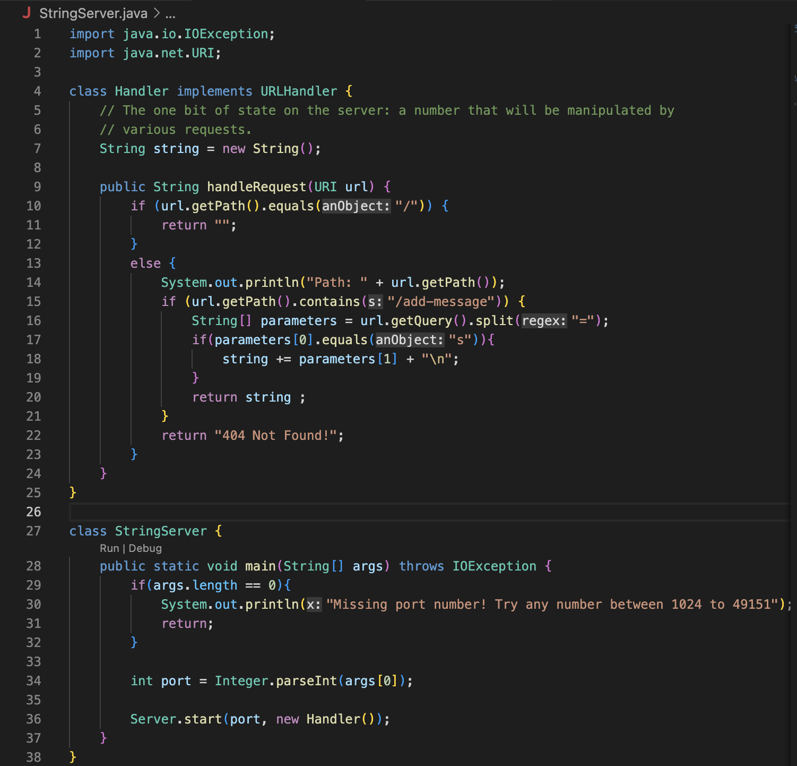
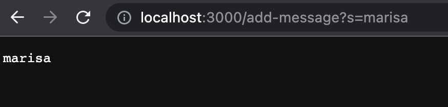
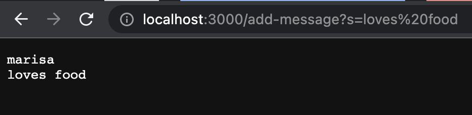

# Marisa Kawakami Week 3: Lab Report 2 - Servers and Bugs 

## Part 1: Simplest Search Engine (week 2) 

---

* The method `String handleRequest(URI url)` is called in from the handler class. 
  * In order to open the web server in the browser you need to compile and run with a port number and in the terminal you will be given a link to open (ex `http:localhost:300`)
* The arguments are the servers port number and the Handler object. The `handleRequest` method will take the url in the above example `localhost:3000/add-message?s=marisa` as the parameter `URI url`. The variable `string` is an empty string in the Handler class. 
  * The port number does not have to be a specific number but it will identify a specifc port that your web server is being run on. 
* Due to the requests inputed into the url it will change what is added to the `string`. Once the url is split creating two seperate elements in the array `parameters` it will add the element `parameters[1]` into the string. Which returns `marisa` on the screen. 
---

* Once again the method `String handleRequest(URI url)` is called in from the handler class.
* The method `handleRequest` takes in the parameter url which for this example is `localhost:3000/add-message?s=loves food`. Since I previously added "marisa" to the string the `string` value is marisa. 
* Due to this request again the url is split into two creating seperate elements in the `parameters` array. It then takes `parameters[1]` and adds it to the string. This then changes the string to include the element from the first example `marisa` and also `loves food`. 
---
## Part 2: Syptoms of Bugs (week 3)
* Buggy program from lab 3: 
  - method `reversed(int[] arr)` 
test that will fail 
```
@Test
  public void testReversed2(){
    int[] input = {1,2,3,4};
    assertArrayEquals(new int[]{4,3,2,1}, ArrayExamples.reversed(input));
```
test that will work accidentaly 

```@Test
  public void testReversed() {
    int[] input1 = { };
    assertArrayEquals(new int[]{ }, ArrayExamples.reversed(input1));
  }
```

buggy code
```
static int[] reversed(int[] arr) {
  int[] newArray = new int[arr.length];
    for(int i = 0; i < arr.length; i += 1) {
      arr[i] = newArray[arr.length - i - 1];
    }
    return arr;
  }
```
fixed code
```
static int[] reversed(int[] arr) {
    int[] newArray = new int[arr.length];
    for(int i = 0; i < arr.length; i += 1) {
      newArray[i] = arr[arr.length -i -1];
    }
    return newArray;
  }
```
## Part 3: 
In week 2 lab I learned how to build and run the server along with having the need to have a port number. The port that is identifying the specific port tthat is being run. 
Notes:
* In order to exit out of a loop in a server you must hit control C 
* 
