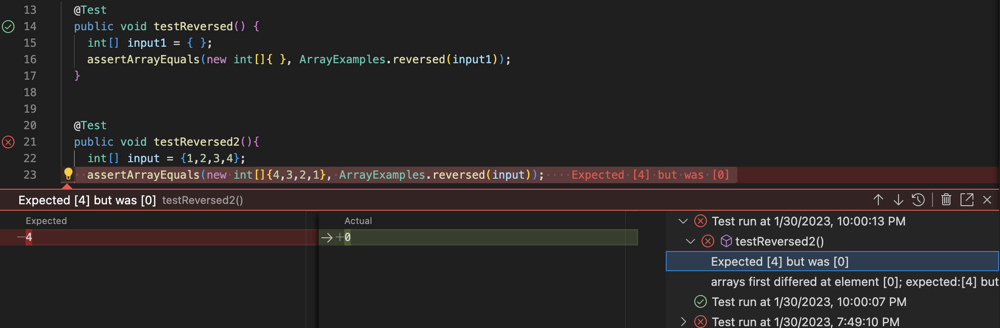

# Marisa Kawakami Week 3: Lab Report 2 - Servers and Bugs 

## Part 1: String Server (week 2) 

---

* The method `String handleRequest(URI url)` is called in from the handler class. 
  * In order to open the web server in the browser you need to compile and run with a port number and in the terminal you will be given a link to open (ex `http:localhost:300`)
* The arguments are the server's port number and the Handler object. The `handleRequest` method will take the url in the above example `localhost:3000/add-message?s=marisa` as the parameter `URI url`. The variable `string` is an empty string in the Handler class. 
  * The port number does not have to be a specific number but it will identify a  specific port that your web server is being run on. 
* Due to the requests inputed into the url it will change what is added to the `string`. Once the url is split creating two separate elements in the array `parameters` will add the element `parameters[1]` into the string, which returns `marisa` on the screen. 
---

* Once again the method `String handleRequest(URI url)` is called in from the handler class.
* The method `handleRequest` takes in the parameter url which for this example is `localhost:3000/add-message?s=loves food`. Since I previously added "marisa" to the string the `string` value is marisa. 
* Due to this request again the url is split into two creating separate elements in the `parameters` array. It then takes `parameters[1]` and adds it to the string. This then changes the string to include the element from the first example `marisa` and also `loves food`. 
---
## Part 2: Symptoms of Bugs (week 3)
* Buggy program from lab 3: 
  - method `reversed(int[] arr)` 

The symptom was that this test failed and since the test was created to find if there was a bug in the code. The bug in the program `reversed` was that every one of the indexes of the arr was being set to 0 and the newArr was just made up of zeros. 

```
@Test
  public void testReversed2(){
    int[] input = {1,2,3,4};
    assertArrayEquals(new int[]{4,3,2,1}, ArrayExamples.reversed(input));
```

This test does not induce a failure even though the code actually contains bugs in it. 

```@Test
  public void testReversed() {
    int[] input1 = { };
    assertArrayEquals(new int[]{ }, ArrayExamples.reversed(input1));
  }
```

This shows that the first tester that is run passes the test while the other tester shows that the expected, is not what is actually returned. 


buggy code
```
static int[] reversed(int[] arr) {
  int[] newArray = new int[arr.length];
    for(int i = 0; i < arr.length; i += 1) {
      arr[i] = newArray[arr.length - i - 1];
    }
    return arr;
  }
```
fixed code
```
static int[] reversed(int[] arr) {
    int[] newArray = new int[arr.length];
    for(int i = 0; i < arr.length; i += 1) {
      newArray[i] = arr[arr.length -i -1];
    }
    return newArray;
  }
```

In order, for the code to properly run the new array needs to be on the left side of the = sign in order for the old array to be reversed in the new array. It is taking the last element from the original array and adds it to the new array. and then return the new array. Rather than having the last half of the indexes set to the first half, then the first half was already changed to the last half so they would not change when it got to the last indexes they would not change.  

## Part 3: 
In week 2 lab I learned how to build and run the server just by changing the url. By doing this I was able to add to things by making edits in the url. When learning this I also learned what a port was and how it identifies the specific port that is being run. During this lab, I was able to connect the code that I was writing that affected what was run when I altered the url. Just by changing a word such as `/add-message` `/increment` `/search` I was able to change what was being looked for or what would run because of this.
note to self:
* In order to exit out of a loop in a server you must hit control C
