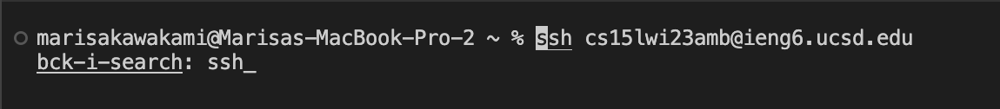
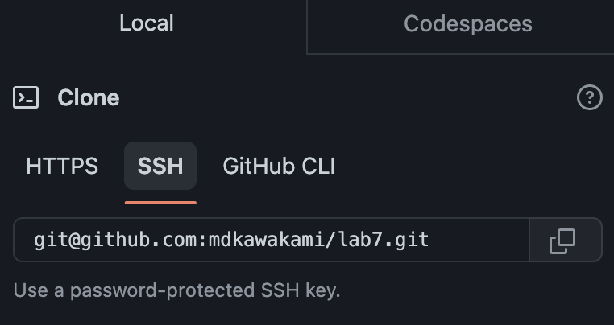
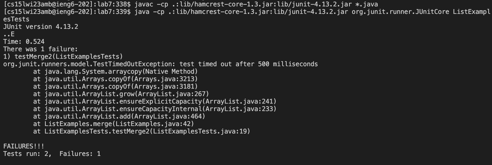
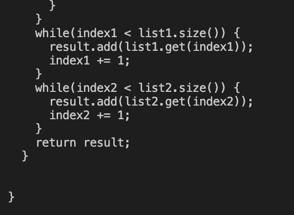
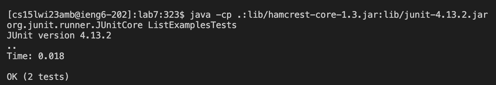
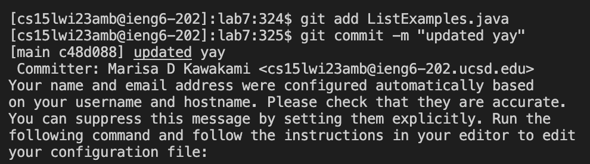
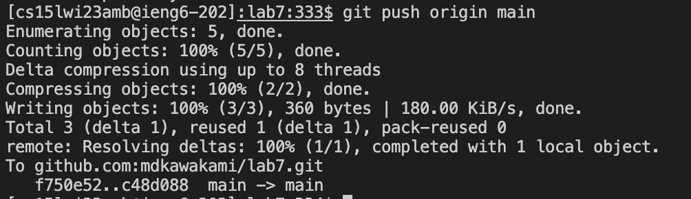

# Marisa Kawakami Week 7: Lab Report 4 

## Steps 4-9 from Lab 7

## 4. Log into ieng6


Keys pressed:
```
<^r>
<ssh>
<enter>
```

In order to find the command to log into my ieng6 account I hit <^r> which is searching through my history. In this command, I typed <ssh> and the command I have used previously to log in came up. With this, I am able to find previous commands rather than typing them through from the start. 
 


## 5. Clone your fork of the repository from your GitHub account 
 
 
  
After opening the repository in GitHub, I forked the repository by hitting the fork button on the right top-hand side. Then from here, I copied the link that is given through the SSH URL when you go to the green code box. Then from here in the command, I typed `git clone` and <^v> to paste the URL.  
  


## 6. Run the tests, demonstrating that they fail 
 
In the command line I again used the <^r> and typed in javac to find `javac -cp .:lib/hamcrest-core-1.3.jar:lib/junit-4.13.2.jar *.java` which is used to compile the tester. Then once again I used <^r> to search for the java command to run the tests, `java -cp .:lib/hamcrest-core-1.3.jar:lib/junit-4.13.2.jar org.junit.runner.JUnitCore`. Along with this I had to change the last one because it had been for a different file. So to the end of this command, I changed it to ListExamplesTests for it to run on this file. (showing that it had a failure) 
  



## 7. Edit the code file to fix the failing test 
  
In order to fix the code I figured out what was causing the error in the actual code. In the command line, I typed `nano ` and then `List` <tab> and then typed .java to get `ListExamples.java`. Then in nano, I used <^w> to search for the return result. Next, I hit arrow <up><up> to get to line 43 where I found the error. Then I went in and changed index1 += 1 to index2 += 1. 

After I fixed the code I hit <^o> (to save the edits that were made) and then hit <enter>. After I hit <^x> to exit out of nano.  
  



## 8. Run the tests, demonstrating that they now succeed
  
Now out of nano, in the command line. I use <^r> to find the javac and java commands to complie the tester and run it once again. After running the test with the new edits on the code it passed the tests! 
  



## 9. Commit and push the resulting change to your GitHub account 
 
In order to commit the change, in the terminal I used `git add List` <tab> and .java to get `git add ListExamples.java`. After running that I used `git commit -m "updated yay"` so that it would display the message. Lastly, in order to push the edits to the main branch I used `git push origin main` in order for the main branch to be fully updated. 
 




Notes/reminders: 
 
To delete a repository such as lab7 through the command line you use `git rm -fr lab7` 

