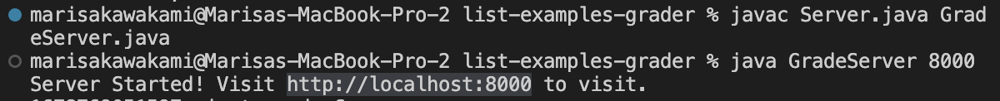
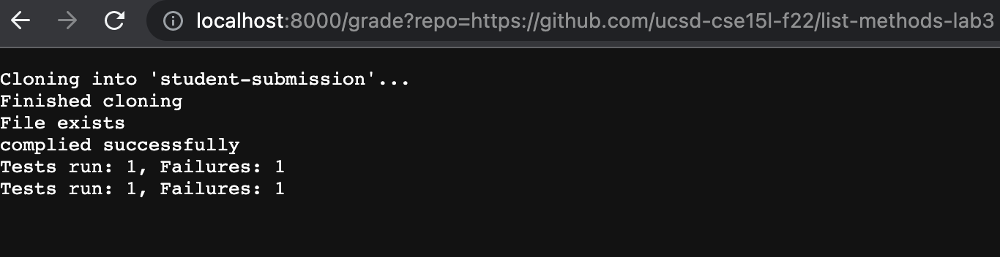

# Marisa Kawakami Week 9: Lab Report 5

## Lab 6: Grading Script 

## **File Exists**

In order to check if the file exists it with be put into an if statement. In this it will use the command `-f` to find the file name. In this case, it is searching for "student-submission/ListExamples.java". If it finds what is in the quotes then it will echo that the file exists, and will continue on with the other tests. If it does not contain this then it will exit and echo that there is no file and the student will receive partial credit and prompts for resubmission. 

```
if [[ -f "student-submission/ListExamples.java" ]]
then 
    echo "File exists"
else 
    echo "No file"
    echo "partial credit - resubmit"
    exit
fi 
```


## **Class Checker**

First, create a variable `CLASS_CHECKER` in bash script. Then using the backticks around what the variable is equal to, it will save the result of what is found in the $CLASS_CHECKER. In order to check if there is a class name called ListExamples, you must use grep which is searching for a string of characters "class ListExamples" in the file. Then using the bash script variable you want to use the if statements in order to find if the file contains the class name or not. I had whatever was found using grep and comparing if that was equal to an empty string. If they did equal each other then it meant that it was missing the class and would echo that it must have the class name. 

```
cp student-submission/ListExamples.java ./
CLASS_CHECKER=`grep "class ListExamples" ListExamples.java`
if [[ $CLASS_CHECKER == "" ]]
then 
    echo "Must have a class ListExamples"
    echo "partial credit - resubmit"
    exit
fi 
```
## **Filter Method Check**

Using the same idea as the class checker you want to create a bash script variable. Within this variable, I checked if the file ListExamples.java contained the string of characters that are needed for the filter method. Once the result of the grep command is stored in the variable, I used an if statement to check if the result (METHOD_FILTER) was an empty string. If they were equal and the result of grep found nothing then it would echo that the filter method signature is wrong and exit. Otherwise, it can continue as it does have the string of characters that are necessary. 

```
METHOD_FILTER=`grep "static List<String> filter(List<String> " ListExamples.java`
if [[ $METHOD_FILTER == "" ]]
then   
    echo "filter method signiture is wrong"
    echo "partial credit - resubmit"
    exit
fi 
```


## **Merge Method Check**

This has a very similar setup to the filter method checker. As it is finding if the student submission has the method merge in their submission. It is using grep once again to find if the student submission file contains the string of characters that are necessary for the merge method. Then using the results stored in the bash script variable it is comparing it to an empty string. If nothing is found when grep is called on it then it will be equal to the empty string and will then echo that there is something wrong with the merge method signature and exit. If nothing is wrong then it will continue because it contains the merge method. 


```
METHOD_MERGE=`grep "static List<String> merge(List<String> " ListExamples.java`
if [[ $METHOD_MERGE == "" ]]
then   
    echo "merge method signiture is wrong"
    echo "partial credit - resubmit"
    exit
fi 
```

## **Compiles**

Next, you want to check that the files are compiling. After running the line `javac -cp $CPATH *.java` it returns an exit code. Then using the $? checks the exit code of what has just been run. Then in an, if statement I checked if the last code that was run is equal to 0, if it is equal to zero then it means that the last line ran successfully. From there if it ran successfully then it will echo that it compiled successfully, otherwise it will echo it did not compile.  

```
javac -cp $CPATH *.java
if [[ $? -eq 0 ]]
then 
    echo "complied successfully"
else 
    echo "it did not complie"
    echo "partial credit - resubmit"
    exit 
fi
```


## **Testing**
Here you want to run the JUnit tests on the student submissions and ensure that all the tests are passing. First making a bash script variable `TEST_OUTPUT` will take the results of running grep and finding if the string of characters has "Tests run:" If there's nothing that's being returned, then everything ran and passed the test. 

```
java -cp $CPATH org.junit.runner.JUnitCore TestListExamples > graded.txt
TEST_OUTPUT=`grep "Tests run: " graded.txt`
echo $TEST_OUTPUT

if [[ $TEST_OUTPUT == "" ]]
then 
    echo "YAYAY 100%"
    exit
fi 

echo $TEST_OUTPUT
```


**Method Passed**


**challenge**


## **Server**

In the terminal, you are able to run the server on a browser. Using the server provided I was able to compile it and run it on a localhost and open it in a browser. 
`javac Server.java GradeServer.java`
`java GradeServer 8000`



