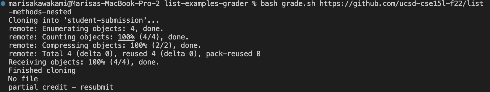
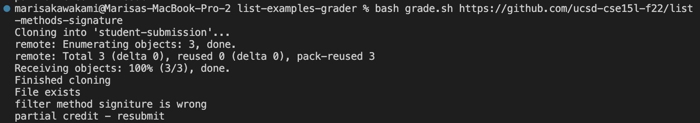
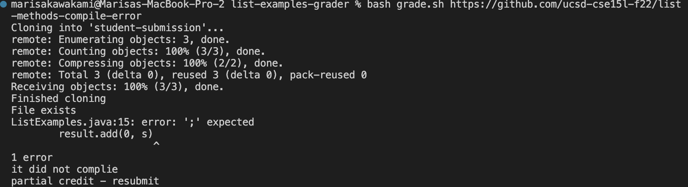
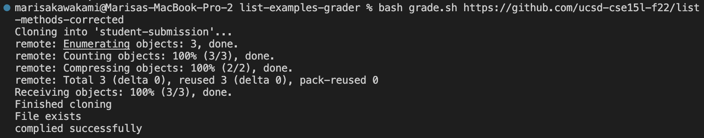
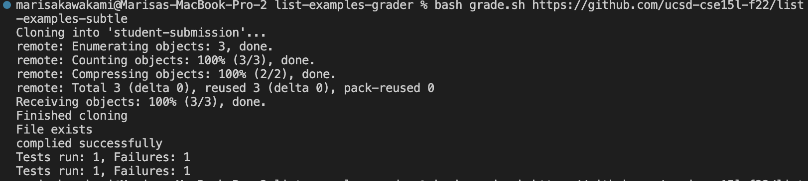

# Marisa Kawakami Week 9: Lab Report 5

## Lab 6: Grading Script 

**File Exists**

In order to check if the file exists it with be put into an if statement. In this it will use the command `-f` to find the file name. In this case it is seraching for "student-submission/ListExamples.java". If it finds what is in the quotes then then it will echo that the file exists, and will continue on with the other tests. If it does not contain this then it will exit and echo that there is no file and the student will recieve partial credit and prompts for resubmission. 
```
if [[ -f "student-submission/ListExamples.java" ]]
then 
    echo "File exists"
else 
    echo "No file"
    echo "partial credit - resubmit"
    exit
fi 
```



**Class Checker**

First creating a variable `CLASS_CHECKER` in bash script. Then using the backticks around what the variable is equal to, it will save the result of what is found in the $CLASS_CHECKER. In order to check if there is a class name called ListExamples, you must use grep which is searching for a string of characters "class ListExamples" in the file. Then using the bash script variable you want to use the if statements in order to find if the file contains the class name or not. I had whatever was found using grep and comparing if that was equal to an empty string. If it did equal eachother then it meant that it was missing the class and would echo that it must have theclass name. 

```
CLASS_CHECKER=`grep "class ListExamples" ListExamples.java`
if [[ $CLASS_CHECKER == "" ]]
then 
    echo "Must have a class ListExamples"
    echo "partial credit - resubmit"
    exit
fi 
```
**Filter Method Check**

Using the same idea as class checker you want to create a bash script variable. Within this variable I checked if the file ListExamples.java contained the string of characters that are needed for the filter method. Once the result of the grep command is stored in the variable, I used an if statement to check if the result (METHOD_FILTER) was an empty string. If they were equal and the result of grep found nothing then it would echo that the filter method signiture is wrong and exit. Otherwise it can continue as it does have the string of characters that are necessary. 

```
METHOD_FILTER=`grep "static List<String> filter(List<String> " ListExamples.java`
if [[ $METHOD_FILTER == "" ]]
then   
    echo "filter method signiture is wrong"
    echo "partial credit - resubmit"
    exit
fi 
```



**Merge Method Check**

This has a very similar set up as the filter method checker. As it is finding if the student submission has the method merge in their submission. It is using grep once again to find if the student submission file contains the string of characters that are nessecary for the merge method. Then using the results stored in the bash script variable it is comparing it an empty string. If nothing is found when grep is called on it then it will be equal to the empty string and will then echo that there is soemthing wrong with the merge method signiture and exit. If nothing is wrong then it will continue because it contians the merge method. 


```
METHOD_MERGE=`grep "static List<String> merge(List<String> " ListExamples.java`
if [[ $METHOD_MERGE == "" ]]
then   
    echo "merge method signiture is wrong"
    echo "partial credit - resubmit"
    exit
fi 
```

**Compiles**

Next you want to check that the files are compiling. 





**Testing**
Here you want to run the JUnit tests on the student submissions and ensure that all the tests are passing. First making a bash script variable `TEST_OUTPUT` will take the results of running grep and finding if 


**Method Passed**



**challenge**

